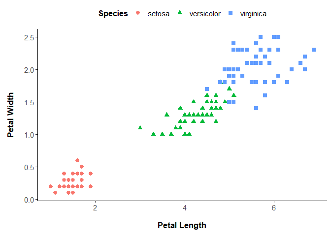

Code for Cleaner Visuals
================

As a burgeoning data analyst, I spend a lot of time creating different
visuals (histograms, bar graphs, scatter plots, etc.). I have a
particular way of styling these visuals to ensure a concise, consistent,
and aesthetically pleasing format. It is also important to have a
signature design for visuals so that fellow analysts can recognize your
work. See the section below for my signature visual design.

## Visual Code and Example Output

Using the `iris` data, see below the code that creates my signature
design and an example output.

``` r
iris %>%
  ggplot(aes(x = Petal.Length, y = Petal.Width, shape = Species, color = Species)) +
  geom_point(size = 2.5) + # enlarges the points on the graph
  labs(x = 'Petal Length',
       y = 'Petal Width') +
  theme_classic() + # theme with no grid lines
  theme(
    axis.title.y = element_text(face = 'bold', color = 'black', # creates bold labels in black font
                  margin = margin(t = 0, r = 15, b = 0, l = 5),size=13), # creates space around the margins of the labels
    axis.title.x = element_text(face = 'bold', color = 'black',
                                margin = margin(t = 15, r = 0, b = 5, l = 0),size=13),
    axis.text.x = element_text(size = 11),  # enlarges the font size of the x and y axis values
    axis.text.y = element_text(size = 11),
    legend.position = 'top',                # places the legend on top with a bold title and larger text
    legend.text = element_text(size = 11),
    legend.title = element_text(face = "bold", size=13))
```
## Example Output
<!-- -->
